# 🚀 PLANO DE ARQUITETURA EMAIL SAAS - ULTRAZEND

**Documento:** Plano Completo de Implementação de Arquitetura Separada  
**Data:** 07/09/2025  
**Versão:** 1.0  
**Responsável:** Equipe de Desenvolvimento

---

## 📋 ÍNDICE

1. [Resumo Executivo](#1-resumo-executivo)
2. [Problemas Identificados](#2-problemas-identificados)
3. [Arquitetura Proposta](#3-arquitetura-proposta)
4. [Plano de Implementação](#4-plano-de-implementação)
5. [Cronograma e Prioridades](#5-cronograma-e-prioridades)
6. [Especificações Técnicas](#6-especificações-técnicas)
7. [Testes e Validação](#7-testes-e-validação)
8. [Critérios de Sucesso](#8-critérios-de-sucesso)

---

## 1. RESUMO EXECUTIVO

### 🎯 **Objetivo**
Implementar arquitetura separada para envio de e-mails, distinguindo entre **e-mails ORIGINADOS PELA APLICAÇÃO** (confirmação, recuperação, notificações) e **e-mails ORIGINADOS PELOS CLIENTES** (via API SaaS), garantindo deliverability, segurança e conformidade com padrões DKIM/SPF.

**IMPORTANTE**: Ambos os tipos podem ter **DESTINOS EXTERNOS** (gmail.com, yahoo.com, etc.)

### 🚨 **Problemas Críticos**
- **DKIM**: Configurado para `ultrazend.com.br` mas sistema envia de `mail.ultrazend.com.br`
- **SPF**: Falta registro SPF para subdomínio `mail.ultrazend.com.br`
- **Segurança**: API permite spoofing de endereços de envio
- **Arquitetura**: Mistura e-mails ORIGINADOS PELA APLICAÇÃO com ORIGINADOS PELOS CLIENTES

### ✅ **Resultado Esperado**
- 100% de deliverability para e-mails da aplicação
- Sistema SaaS seguro para clientes
- Configuração automática de DKIM/SPF
- Fallback inteligente para domínios não configurados

---

## 2. PROBLEMAS IDENTIFICADOS

### 🔍 **Auditoria Técnica Completa**

#### **2.1 Falhas de Autenticação DNS**
```
PROBLEMA ATUAL:
- Sistema envia: noreply@mail.ultrazend.com.br
- DKIM existe: ultrazend.com.br (mismatch)
- SPF falta: mail.ultrazend.com.br
- Gmail rejeita: "DKIM = did not pass" + "SPF = did not pass"
```

#### **2.2 Vulnerabilidade de Segurança na API**
```typescript
// PROBLEMA: sendEmailSchema permite qualquer FROM
sendEmailSchema = z.object({
  from: emailSchema, // ❌ SEM VALIDAÇÃO DE PROPRIEDADE
  to: z.union([emailSchema, z.array(emailSchema)]),
});
```

#### **2.3 Dados do Banco - Estado Atual**
```sql
-- Usuários: 3 (1 sistema + 2 reais)
-- Domínios configurados: 1 (ultrazend.com.br)
-- DKIM ativo: ✅ ultrazend.com.br
-- Tabela user_domain_permissions: ❌ NÃO EXISTE
```

#### **2.4 Arquitetura Atual - Problemas**
- ✅ Infraestrutura SMTP funcionando (portas 25, 587, 2525)
- ✅ PM2 e NGINX operacionais
- ❌ Lógica de envio não diferencia origem (app vs cliente)
- ❌ Validação de domínio inexistente na API

---

## 3. ARQUITETURA PROPOSTA

### 🏗️ **Modelo de Duas Camadas**

```mermaid
graph TB
    subgraph "CAMADA 1: E-mails da Aplicação"
        A1[Confirmação de Cadastro] --> S1[EmailService Interno]
        A2[Recuperação de Senha] --> S1
        A3[Notificações do Sistema] --> S1
        S1 --> D1[FROM: noreply@ultrazend.com.br]
        D1 --> DKIM1[DKIM: ultrazend.com.br ✅]
    end
    
    subgraph "CAMADA 2: E-mails dos Clientes SaaS"
        B1[API /emails/send] --> V1[Validador de Domínio]
        V1 --> |Domínio Próprio| S2[EmailService Externo]
        V1 --> |Sem Domínio| S3[EmailService Fallback]
        S2 --> D2[FROM: cliente@seudominio.com]
        S3 --> D3[FROM: noreply+user123@ultrazend.com.br]
        D2 --> DKIM2[DKIM: seudominio.com]
        D3 --> DKIM3[DKIM: ultrazend.com.br]
    end
```



### 🔧 **Componentes Principais**

#### **3.1 EmailServiceFactory** 
```typescript
class EmailServiceFactory {
  static createService(type: 'internal' | 'external'): EmailService {
    switch(type) {
      case 'internal': return new InternalEmailService();
      case 'external': return new ExternalEmailService();
    }
  }
}
```

#### **3.2 DomainValidator**
```typescript
class DomainValidator {
  async validateSenderDomain(userId: number, fromEmail: string): Promise<ValidatedSender> {
    const domain = this.extractDomain(fromEmail);
    
    // Verificar propriedade do domínio
    const ownsDomain = await this.checkDomainOwnership(userId, domain);
    
    if (ownsDomain) {
      return { email: fromEmail, dkimDomain: domain, valid: true };
    }
    
    // Fallback para domínio principal
    return { 
      email: `noreply+user${userId}@ultrazend.com.br`, 
      dkimDomain: 'ultrazend.com.br',
      valid: true,
      fallback: true
    };
  }
}
```

#### **3.3 MultiDomainDKIMManager**
```typescript
class MultiDomainDKIMManager {
  async getDKIMConfigForDomain(domain: string): Promise<DKIMConfig> {
    // 1. Buscar configuração específica
    const config = await db('dkim_keys')
      .join('domains', 'domains.id', 'dkim_keys.domain_id')
      .where('domains.domain_name', domain)
      .where('dkim_keys.is_active', true)
      .first();
      
    // 2. Fallback para configuração padrão
    return config || this.getDefaultDKIMConfig();
  }
}
```

---

## 4. PLANO DE IMPLEMENTAÇÃO

### 🚀 **FASE 1: CORREÇÃO CRÍTICA (PRIORITÁRIO - 2 dias)**

#### **Objetivo:** Resolver problemas de deliverability imediatamente

#### **4.1.1 Correção do Domínio de Envio**
```typescript
// 📁 backend/src/services/emailService.ts:110
// ANTES:
from: `noreply@${Env.get('SMTP_HOSTNAME', 'ultrazend.com.br')}`,

// DEPOIS:
from: `noreply@ultrazend.com.br`,
```

#### **4.1.2 Implementação Rápida de Validação**
```typescript
// 📁 backend/src/middleware/emailValidation.ts
export const validateSenderMiddleware = asyncHandler(async (
  req: AuthenticatedRequest, 
  _res: Response, 
  next: NextFunction
) => {
  const { from } = req.body;
  const userId = req.user!.id;
  
  // Validação básica temporária
  const domain = from.split('@')[1];
  const ownsDomain = await db('domains')
    .where('user_id', userId)
    .where('domain_name', domain)
    .where('is_verified', true)
    .first();
    
  if (!ownsDomain) {
    // Força uso do domínio principal
    req.body.from = `noreply+user${userId}@ultrazend.com.br`;
    logger.warn('Email sender corrected to safe domain', { 
      originalFrom: from, 
      correctedTo: req.body.from,
      userId 
    });
  }
  
  next();
});
```

#### **4.1.3 Aplicar Middleware na API**
```typescript
// 📁 backend/src/routes/emails.ts:17
router.post('/send', 
  authenticateApiKey,
  requirePermission('email:send'),
  validateSenderMiddleware, // 🆕 NOVA VALIDAÇÃO
  emailSendRateLimit,
  validateRequest({ body: sendEmailSchema }),
  asyncHandler(async (req: AuthenticatedRequest, res: Response) => {
    // ... resto do código inalterado
  })
);
```

#### **4.1.4 Deploy Imediato**
```bash
# Comandos para execução na VPS
ssh root@ultrazend.com.br
cd /var/www/ultrazend

# Backup antes das alterações
cp backend/src/services/emailService.ts backend/src/services/emailService.backup.ts
cp backend/src/routes/emails.ts backend/src/routes/emails.backup.ts

# Aplicar correções (via deploy automático)
git pull origin main
cd backend && npm run build
pm2 restart ultrazend-api

# Verificar logs
pm2 logs ultrazend-api --lines 50
```

---

### 🔧 **FASE 2: ARQUITETURA MULTI-DOMÍNIO (1 semana)**

#### **Objetivo:** Implementar suporte robusto a múltiplos domínios

#### **4.2.1 Criação do EmailServiceFactory**
```typescript
// 📁 backend/src/services/EmailServiceFactory.ts
export enum EmailServiceType {
  INTERNAL = 'internal',
  EXTERNAL = 'external'
}

export class EmailServiceFactory {
  static createService(type: EmailServiceType, options?: any): IEmailService {
    switch(type) {
      case EmailServiceType.INTERNAL:
        return new InternalEmailService({
          defaultFrom: 'noreply@ultrazend.com.br',
          dkimDomain: 'ultrazend.com.br'
        });
        
      case EmailServiceType.EXTERNAL:
        return new ExternalEmailService({
          domainValidator: new DomainValidator(),
          dkimManager: new MultiDomainDKIMManager()
        });
        
      default:
        throw new Error(`Unsupported email service type: ${type}`);
    }
  }
}
```

#### **4.2.2 InternalEmailService (E-mails da Aplicação)**
```typescript
// 📁 backend/src/services/InternalEmailService.ts
export class InternalEmailService implements IEmailService {
  private readonly DEFAULT_FROM = 'noreply@ultrazend.com.br';
  private readonly DKIM_DOMAIN = 'ultrazend.com.br';
  
  async sendVerificationEmail(email: string, name: string, token: string): Promise<void> {
    const emailData = {
      from: this.DEFAULT_FROM,
      to: email,
      subject: 'Verifique seu email - UltraZend',
      html: this.generateVerificationEmailHTML(name, token),
      text: this.generateVerificationEmailText(name, token)
    };
    
    return this.smtpDelivery.deliverEmail(emailData);
  }
  
  async sendPasswordResetEmail(email: string, name: string, resetUrl: string): Promise<void> {
    // Implementação similar...
  }
  
  async sendSystemNotification(email: string, notification: SystemNotification): Promise<void> {
    // Implementação similar...
  }
}
```

#### **4.2.3 ExternalEmailService (E-mails dos Clientes)**
```typescript
// 📁 backend/src/services/ExternalEmailService.ts
export class ExternalEmailService implements IEmailService {
  constructor(
    private domainValidator: DomainValidator,
    private dkimManager: MultiDomainDKIMManager
  ) {}
  
  async sendEmail(emailData: SendEmailOptions): Promise<EmailResult> {
    // 1. Validar e corrigir sender
    const validatedSender = await this.domainValidator.validateSenderDomain(
      emailData.userId, 
      emailData.from
    );
    
    // 2. Obter configuração DKIM apropriada
    const dkimConfig = await this.dkimManager.getDKIMConfigForDomain(
      validatedSender.dkimDomain
    );
    
    // 3. Preparar email com configurações corretas
    const processedEmailData = {
      ...emailData,
      from: validatedSender.email,
      dkimConfig
    };
    
    // 4. Log para auditoria
    logger.info('External email prepared for delivery', {
      userId: emailData.userId,
      originalFrom: emailData.from,
      finalFrom: validatedSender.email,
      dkimDomain: validatedSender.dkimDomain,
      wasCorrected: validatedSender.fallback || false
    });
    
    // 5. Entregar via SMTP
    return this.smtpDelivery.deliverEmail(processedEmailData);
  }
}
```

#### **4.2.4 DomainValidator Completo**
```typescript
// 📁 backend/src/services/DomainValidator.ts
export interface ValidatedSender {
  email: string;
  dkimDomain: string;
  valid: boolean;
  fallback?: boolean;
  reason?: string;
}

export class DomainValidator {
  async validateSenderDomain(userId: number, fromEmail: string): Promise<ValidatedSender> {
    try {
      const domain = this.extractDomain(fromEmail);
      
      // 1. Verificar se é domínio da aplicação
      if (this.isInternalDomain(domain)) {
        return {
          email: fromEmail,
          dkimDomain: 'ultrazend.com.br',
          valid: true
        };
      }
      
      // 2. Verificar propriedade do domínio pelo usuário
      const domainRecord = await this.checkDomainOwnership(userId, domain);
      
      if (domainRecord && domainRecord.is_verified) {
        return {
          email: fromEmail,
          dkimDomain: domain,
          valid: true
        };
      }
      
      // 3. Fallback para domínio principal
      return {
        email: `noreply+user${userId}@ultrazend.com.br`,
        dkimDomain: 'ultrazend.com.br',
        valid: true,
        fallback: true,
        reason: domainRecord ? 'Domain not verified' : 'Domain not owned'
      };
      
    } catch (error) {
      logger.error('Domain validation error', { error, userId, fromEmail });
      
      // Fallback de segurança
      return {
        email: `noreply+user${userId}@ultrazend.com.br`,
        dkimDomain: 'ultrazend.com.br',
        valid: true,
        fallback: true,
        reason: 'Validation error'
      };
    }
  }
  
  private isInternalDomain(domain: string): boolean {
    const internalDomains = [
      'ultrazend.com.br',
      'mail.ultrazend.com.br',
      'www.ultrazend.com.br'
    ];
    return internalDomains.includes(domain);
  }
  
  private async checkDomainOwnership(userId: number, domain: string) {
    return db('domains')
      .where('user_id', userId)
      .where('domain_name', domain)
      .first();
  }
  
  private extractDomain(email: string): string {
    return email.split('@')[1]?.toLowerCase() || '';
  }
}
```

#### **4.2.5 MultiDomainDKIMManager**
```typescript
// 📁 backend/src/services/MultiDomainDKIMManager.ts
export class MultiDomainDKIMManager extends DKIMManager {
  async getDKIMConfigForDomain(domain: string): Promise<DKIMConfig | null> {
    try {
      // 1. Buscar configuração específica do domínio
      const domainConfig = await db('dkim_keys')
        .select('dkim_keys.*', 'domains.domain_name')
        .join('domains', 'domains.id', 'dkim_keys.domain_id')
        .where('domains.domain_name', domain)
        .where('dkim_keys.is_active', true)
        .first();
        
      if (domainConfig) {
        logger.debug('Found DKIM config for domain', { domain });
        return this.parseDKIMConfig(domainConfig);
      }
      
      // 2. Para domínio principal, usar configuração padrão
      if (domain === 'ultrazend.com.br') {
        return this.getDefaultDKIMConfig();
      }
      
      // 3. Para outros domínios, tentar gerar configuração automática
      return this.generateDKIMConfigForDomain(domain);
      
    } catch (error) {
      logger.error('Error getting DKIM config', { error, domain });
      return this.getDefaultDKIMConfig(); // Fallback seguro
    }
  }
  
  private async generateDKIMConfigForDomain(domain: string): Promise<DKIMConfig | null> {
    try {
      // Verificar se domínio existe na tabela domains
      const domainRecord = await db('domains')
        .where('domain_name', domain)
        .where('is_verified', true)
        .first();
        
      if (!domainRecord) {
        logger.warn('Domain not found or not verified', { domain });
        return null;
      }
      
      // Gerar chaves DKIM automaticamente se não existirem
      const existingKey = await db('dkim_keys')
        .where('domain_id', domainRecord.id)
        .first();
        
      if (!existingKey) {
        logger.info('Generating DKIM keys for domain', { domain });
        await this.generateAndStoreDKIMKeys(domainRecord.id, domain);
        
        // Buscar configuração recém-criada
        return this.getDKIMConfigForDomain(domain);
      }
      
      return this.parseDKIMConfig(existingKey);
      
    } catch (error) {
      logger.error('Error generating DKIM config', { error, domain });
      return null;
    }
  }
}
```

---

### 🎨 **FASE 3: INTERFACE DO CLIENTE (1 semana)**

#### **Objetivo:** Permitir que clientes configurem seus domínios facilmente

#### **4.3.1 API de Configuração de Domínio**
```typescript
// 📁 backend/src/routes/domain-setup.ts
import { Router, Response } from 'express';
import { AuthenticatedRequest, authenticateJWT } from '../middleware/auth';
import { DomainSetupService } from '../services/DomainSetupService';

const router = Router();
router.use(authenticateJWT);

// Iniciar configuração de domínio
router.post('/setup', asyncHandler(async (req: AuthenticatedRequest, res: Response) => {
  const { domain } = req.body;
  const userId = req.user!.id;
  
  const setupService = new DomainSetupService();
  const result = await setupService.initiateDomainSetup(userId, domain);
  
  res.json({
    success: true,
    domain: result.domain,
    dnsInstructions: result.dnsInstructions,
    verificationToken: result.verificationToken
  });
}));

// Verificar configuração DNS
router.post('/:domainId/verify', asyncHandler(async (req: AuthenticatedRequest, res: Response) => {
  const { domainId } = req.params;
  const userId = req.user!.id;
  
  const setupService = new DomainSetupService();
  const verification = await setupService.verifyDomainSetup(userId, domainId);
  
  res.json({
    success: verification.success,
    results: verification.results,
    nextSteps: verification.nextSteps
  });
}));

// Obter status de todos os domínios do usuário
router.get('/status', asyncHandler(async (req: AuthenticatedRequest, res: Response) => {
  const userId = req.user!.id;
  
  const domains = await db('domains')
    .select('*')
    .where('user_id', userId)
    .orderBy('created_at', 'desc');
    
  // Enriquecer com status DKIM
  const domainsWithStatus = await Promise.all(
    domains.map(async (domain) => {
      const dkimStatus = await this.checkDKIMStatus(domain.domain_name);
      const spfStatus = await this.checkSPFStatus(domain.domain_name);
      
      return {
        ...domain,
        dkim_status: dkimStatus,
        spf_status: spfStatus,
        overall_status: this.calculateOverallStatus(domain, dkimStatus, spfStatus)
      };
    })
  );
  
  res.json({ domains: domainsWithStatus });
}));

export default router;
```

#### **4.3.2 DomainSetupService**
```typescript
// 📁 backend/src/services/DomainSetupService.ts
export interface DomainSetupResult {
  domain: DomainRecord;
  dnsInstructions: DNSInstructions;
  verificationToken: string;
}

export interface DNSInstructions {
  spf: {
    record: string;
    value: string;
    priority: number;
  };
  dkim: {
    record: string;
    value: string;
    priority: number;
  };
  dmarc: {
    record: string;
    value: string;
    priority: number;
  };
  verification: {
    record: string;
    value: string;
    description: string;
  };
}

export class DomainSetupService {
  async initiateDomainSetup(userId: number, domain: string): Promise<DomainSetupResult> {
    // 1. Validar domínio
    if (!this.isValidDomain(domain)) {
      throw new Error('Invalid domain format');
    }
    
    // 2. Verificar se já existe
    const existingDomain = await db('domains')
      .where('user_id', userId)
      .where('domain_name', domain)
      .first();
      
    if (existingDomain) {
      throw new Error('Domain already configured');
    }
    
    // 3. Gerar token de verificação
    const verificationToken = this.generateVerificationToken();
    
    // 4. Criar registro do domínio
    const domainData = {
      user_id: userId,
      domain_name: domain,
      verification_token: verificationToken,
      verification_method: 'dns',
      is_verified: false,
      dkim_enabled: true,
      dkim_selector: 'default',
      spf_enabled: true,
      dmarc_enabled: true,
      dmarc_policy: 'quarantine',
      created_at: new Date(),
      updated_at: new Date()
    };
    
    const [domainId] = await db('domains').insert(domainData);
    const domainRecord = await db('domains').where('id', domainId).first();
    
    // 5. Gerar chaves DKIM
    const dkimKeys = await this.generateDKIMKeysForDomain(domainId, domain);
    
    // 6. Criar instruções DNS
    const dnsInstructions = this.createDNSInstructions(
      domain,
      verificationToken,
      dkimKeys.publicKey
    );
    
    logger.info('Domain setup initiated', { userId, domain, domainId });
    
    return {
      domain: domainRecord,
      dnsInstructions,
      verificationToken
    };
  }
  
  async verifyDomainSetup(userId: number, domainId: string): Promise<VerificationResult> {
    const domain = await db('domains')
      .where('id', domainId)
      .where('user_id', userId)
      .first();
      
    if (!domain) {
      throw new Error('Domain not found');
    }
    
    const results = await this.performDNSVerification(domain);
    
    // Atualizar status do domínio se todas as verificações passaram
    if (results.all_passed) {
      await db('domains')
        .where('id', domainId)
        .update({
          is_verified: true,
          verified_at: new Date(),
          updated_at: new Date()
        });
    }
    
    return results;
  }
  
  private createDNSInstructions(domain: string, verificationToken: string, dkimPublicKey: string): DNSInstructions {
    return {
      spf: {
        record: `${domain} TXT`,
        value: `"v=spf1 include:ultrazend.com.br ~all"`,
        priority: 1
      },
      dkim: {
        record: `default._domainkey.${domain} TXT`,
        value: `"v=DKIM1; k=rsa; p=${dkimPublicKey}"`,
        priority: 2
      },
      dmarc: {
        record: `_dmarc.${domain} TXT`,
        value: `"v=DMARC1; p=quarantine; rua=mailto:dmarc@ultrazend.com.br"`,
        priority: 3
      },
      verification: {
        record: `ultrazend-verification.${domain} TXT`,
        value: `"${verificationToken}"`,
        description: 'Temporary record to verify domain ownership'
      }
    };
  }
  
  private async performDNSVerification(domain: DomainRecord): Promise<VerificationResult> {
    const results = {
      spf: await this.verifySpfRecord(domain.domain_name),
      dkim: await this.verifyDkimRecord(domain.domain_name, domain.dkim_selector),
      dmarc: await this.verifyDmarcRecord(domain.domain_name),
      verification: await this.verifyDomainOwnership(domain.domain_name, domain.verification_token)
    };
    
    const all_passed = Object.values(results).every(r => r.valid);
    
    return {
      ...results,
      all_passed,
      domain: domain.domain_name,
      verified_at: new Date(),
      nextSteps: all_passed ? [] : this.generateNextSteps(results)
    };
  }
}
```

#### **4.3.3 Frontend - Painel de Configuração**
```typescript
// 📁 frontend/src/pages/DomainSetup.tsx
import React, { useState, useEffect } from 'react';
import { Card, Button, Alert, Stepper, Step, StepLabel } from '@mui/material';
import { useDomainSetup } from '../hooks/useDomainSetup';

export const DomainSetup: React.FC = () => {
  const [currentStep, setCurrentStep] = useState(0);
  const [domain, setDomain] = useState('');
  const [setupResult, setSetupResult] = useState(null);
  const { initiateDomainSetup, verifyDomainSetup, loading } = useDomainSetup();
  
  const steps = [
    'Enter Domain',
    'Configure DNS',
    'Verify Setup',
    'Complete'
  ];
  
  const handleDomainSubmit = async (e) => {
    e.preventDefault();
    try {
      const result = await initiateDomainSetup(domain);
      setSetupResult(result);
      setCurrentStep(1);
    } catch (error) {
      // Handle error
    }
  };
  
  const handleVerification = async () => {
    try {
      const result = await verifyDomainSetup(setupResult.domain.id);
      if (result.all_passed) {
        setCurrentStep(3);
      } else {
        // Show specific errors
      }
    } catch (error) {
      // Handle error
    }
  };
  
  return (
    <div className="domain-setup-container">
      <Card>
        <Stepper activeStep={currentStep}>
          {steps.map((label) => (
            <Step key={label}>
              <StepLabel>{label}</StepLabel>
            </Step>
          ))}
        </Stepper>
        
        {currentStep === 0 && (
          <form onSubmit={handleDomainSubmit}>
            <h2>Add Your Domain</h2>
            <input
              type="text"
              value={domain}
              onChange={(e) => setDomain(e.target.value)}
              placeholder="example.com"
              required
            />
            <Button type="submit" disabled={loading}>
              Configure Domain
            </Button>
          </form>
        )}
        
        {currentStep === 1 && setupResult && (
          <div className="dns-instructions">
            <h2>Configure DNS Records</h2>
            <Alert severity="info">
              Add the following DNS records to your domain:
            </Alert>
            
            {Object.entries(setupResult.dnsInstructions).map(([type, instruction]) => (
              <div key={type} className="dns-record">
                <h3>{type.toUpperCase()}</h3>
                <code>
                  {instruction.record} = "{instruction.value}"
                </code>
                <Button onClick={() => navigator.clipboard.writeText(instruction.value)}>
                  Copy
                </Button>
              </div>
            ))}
            
            <Button onClick={() => setCurrentStep(2)}>
              I've Added These Records
            </Button>
          </div>
        )}
        
        {currentStep === 2 && (
          <div className="verification-step">
            <h2>Verify Configuration</h2>
            <p>Click verify to check your DNS records</p>
            <Button onClick={handleVerification} disabled={loading}>
              Verify DNS Records
            </Button>
          </div>
        )}
        
        {currentStep === 3 && (
          <div className="completion-step">
            <h2>🎉 Domain Setup Complete!</h2>
            <p>Your domain is now configured and ready to send emails.</p>
            <Button onClick={() => window.location.href = '/dashboard'}>
              Go to Dashboard
            </Button>
          </div>
        )}
      </Card>
    </div>
  );
};
```

---

### 🔒 **FASE 4: SEGURANÇA E MONITORAMENTO (1 semana)**

#### **Objetivo:** Implementar logs, monitoramento e segurança avançada

#### **4.4.1 Sistema de Auditoria**
```typescript
// 📁 backend/src/services/EmailAuditService.ts
export interface EmailAuditLog {
  id: string;
  userId: number;
  emailId: string;
  originalFrom: string;
  finalFrom: string;
  wasModified: boolean;
  modificationReason?: string;
  dkimDomain: string;
  deliveryStatus: 'queued' | 'sent' | 'failed';
  timestamp: Date;
  metadata: any;
}

export class EmailAuditService {
  async logEmailEvent(event: Partial<EmailAuditLog>): Promise<void> {
    const auditLog: EmailAuditLog = {
      id: this.generateAuditId(),
      timestamp: new Date(),
      ...event
    } as EmailAuditLog;
    
    // Salvar em tabela de auditoria
    await db('email_audit_logs').insert(auditLog);
    
    // Log estruturado para observabilidade
    logger.info('Email audit event', {
      auditId: auditLog.id,
      userId: auditLog.userId,
      action: this.determineAction(auditLog),
      security: {
        wasModified: auditLog.wasModified,
        reason: auditLog.modificationReason
      },
      performance: {
        dkimDomain: auditLog.dkimDomain,
        deliveryStatus: auditLog.deliveryStatus
      }
    });
  }
  
  async getAuditLogsForUser(userId: number, filters?: AuditFilters): Promise<EmailAuditLog[]> {
    let query = db('email_audit_logs').where('user_id', userId);
    
    if (filters?.startDate) {
      query = query.where('timestamp', '>=', filters.startDate);
    }
    
    if (filters?.endDate) {
      query = query.where('timestamp', '<=', filters.endDate);
    }
    
    if (filters?.wasModified !== undefined) {
      query = query.where('was_modified', filters.wasModified);
    }
    
    return query.orderBy('timestamp', 'desc').limit(100);
  }
  
  async generateSecurityReport(userId: number): Promise<SecurityReport> {
    const logs = await this.getAuditLogsForUser(userId, {
      startDate: new Date(Date.now() - 30 * 24 * 60 * 60 * 1000) // 30 dias
    });
    
    const totalEmails = logs.length;
    const modifiedEmails = logs.filter(log => log.wasModified).length;
    const failedDeliveries = logs.filter(log => log.deliveryStatus === 'failed').length;
    
    return {
      userId,
      period: '30 days',
      totalEmails,
      modifiedEmails,
      modificationRate: (modifiedEmails / totalEmails) * 100,
      failedDeliveries,
      deliveryRate: ((totalEmails - failedDeliveries) / totalEmails) * 100,
      securityFlags: this.identifySecurityFlags(logs),
      recommendations: this.generateRecommendations(logs)
    };
  }
}
```

#### **4.4.2 Dashboard de Monitoramento**
```typescript
// 📁 backend/src/routes/monitoring.ts
router.get('/email-health', authenticateJWT, asyncHandler(async (req: AuthenticatedRequest, res: Response) => {
  const userId = req.user!.id;
  const auditService = new EmailAuditService();
  
  const [securityReport, recentLogs, domainStats] = await Promise.all([
    auditService.generateSecurityReport(userId),
    auditService.getAuditLogsForUser(userId, { limit: 10 }),
    this.getDomainDeliveryStats(userId)
  ]);
  
  res.json({
    security: securityReport,
    recentActivity: recentLogs,
    domains: domainStats,
    systemHealth: await this.getSystemHealthMetrics()
  });
}));
```

#### **4.4.3 Alertas Automáticos**
```typescript
// 📁 backend/src/services/AlertingService.ts
export class AlertingService {
  async checkDeliveryHealth(): Promise<void> {
    const recentFailures = await db('email_audit_logs')
      .where('delivery_status', 'failed')
      .where('timestamp', '>=', new Date(Date.now() - 60 * 60 * 1000)) // 1 hora
      .count('* as count')
      .first();
      
    const failureCount = recentFailures?.count || 0;
    
    if (failureCount > 10) { // Threshold configurable
      await this.sendAlert({
        type: 'HIGH_FAILURE_RATE',
        severity: 'CRITICAL',
        message: `High email failure rate detected: ${failureCount} failures in the last hour`,
        data: { failureCount, timeWindow: '1 hour' },
        actions: [
          'Check DKIM configuration',
          'Verify DNS records',
          'Review SMTP server health'
        ]
      });
    }
  }
  
  async checkSuspiciousActivity(): Promise<void> {
    // Detectar padrões suspeitos
    const suspiciousPatterns = await db('email_audit_logs')
      .select('user_id')
      .where('was_modified', true)
      .where('timestamp', '>=', new Date(Date.now() - 24 * 60 * 60 * 1000))
      .groupBy('user_id')
      .havingRaw('COUNT(*) > 50') // 50+ modificações em 24h
      .orderBy(db.raw('COUNT(*)'), 'desc');
      
    for (const pattern of suspiciousPatterns) {
      await this.sendAlert({
        type: 'SUSPICIOUS_ACTIVITY',
        severity: 'WARNING',
        message: `High rate of email modifications detected for user ${pattern.user_id}`,
        data: pattern,
        actions: [
          'Review user\'s domain configuration',
          'Check for misconfigured FROM addresses',
          'Consider user education'
        ]
      });
    }
  }
  
  private async sendAlert(alert: Alert): Promise<void> {
    // Implementar notificação via webhook, email, Slack, etc.
    logger.error('System alert triggered', alert);
    
    // Salvar alerta para dashboard
    await db('system_alerts').insert({
      type: alert.type,
      severity: alert.severity,
      message: alert.message,
      data: JSON.stringify(alert.data),
      actions: JSON.stringify(alert.actions),
      created_at: new Date()
    });
  }
}
```

---

## 5. CRONOGRAMA E PRIORIDADES

### 📅 **Timeline Detalhado**

| Fase | Duração | Prioridade | Entregáveis | Responsável |
|------|---------|------------|------------|-------------|
| **Fase 1** | 2 dias | 🔴 CRÍTICA | ✅ Deliverability 100%<br>✅ Validação básica<br>✅ Deploy seguro | DevOps + Backend |
| **Fase 2** | 1 semana | 🟡 ALTA | ✅ Arquitetura multi-domínio<br>✅ DKIM automático<br>✅ APIs robustas | Backend Team |
| **Fase 3** | 1 semana | 🟢 MÉDIA | ✅ Interface do cliente<br>✅ Setup wizard<br>✅ DNS automation | Frontend + Backend |
| **Fase 4** | 1 semana | 🔵 BAIXA | ✅ Monitoramento<br>✅ Alertas<br>✅ Relatórios | DevOps + QA |

### ⏰ **Cronograma Otimizado**

#### **Semana 1**
- **Dia 1-2**: Fase 1 (Correção Crítica)
- **Dia 3-5**: Início Fase 2 (Arquitetura)

#### **Semana 2**
- **Dia 1-3**: Finalizar Fase 2
- **Dia 4-5**: Início Fase 3 (Interface)

#### **Semana 3**
- **Dia 1-3**: Finalizar Fase 3
- **Dia 4-5**: Início Fase 4 (Monitoramento)

#### **Semana 4**
- **Dia 1-2**: Finalizar Fase 4
- **Dia 3-5**: Testes finais e deploy

---

## 6. ESPECIFICAÇÕES TÉCNICAS

### 🛠️ **Tecnologias e Dependências**

#### **6.1 Backend**
```json
{
  "dependencies": {
    "nodemailer": "^6.9.0",
    "dkim-signer": "^0.2.2",
    "dns": "builtin",
    "validator": "^13.11.0",
    "zod": "^3.22.0"
  },
  "newDependencies": {
    "@types/dns": "^0.1.0",
    "punycode": "^2.3.0"
  }
}
```

#### **6.2 Banco de Dados - Novas Tabelas**
```sql
-- Auditoria de e-mails
CREATE TABLE email_audit_logs (
  id INTEGER PRIMARY KEY AUTOINCREMENT,
  user_id INTEGER NOT NULL,
  email_id VARCHAR(255),
  original_from VARCHAR(255) NOT NULL,
  final_from VARCHAR(255) NOT NULL,
  was_modified BOOLEAN DEFAULT FALSE,
  modification_reason TEXT,
  dkim_domain VARCHAR(255) NOT NULL,
  delivery_status VARCHAR(20) NOT NULL,
  timestamp DATETIME DEFAULT CURRENT_TIMESTAMP,
  metadata JSON,
  FOREIGN KEY (user_id) REFERENCES users(id)
);

-- Permissões de domínio por usuário
CREATE TABLE user_domain_permissions (
  id INTEGER PRIMARY KEY AUTOINCREMENT,
  user_id INTEGER NOT NULL,
  domain VARCHAR(255) NOT NULL,
  permission_type VARCHAR(50) DEFAULT 'send',
  is_active BOOLEAN DEFAULT TRUE,
  granted_at DATETIME DEFAULT CURRENT_TIMESTAMP,
  granted_by INTEGER,
  FOREIGN KEY (user_id) REFERENCES users(id),
  FOREIGN KEY (granted_by) REFERENCES users(id),
  UNIQUE(user_id, domain)
);

-- Alertas do sistema
CREATE TABLE system_alerts (
  id INTEGER PRIMARY KEY AUTOINCREMENT,
  type VARCHAR(100) NOT NULL,
  severity VARCHAR(20) NOT NULL,
  message TEXT NOT NULL,
  data JSON,
  actions JSON,
  resolved BOOLEAN DEFAULT FALSE,
  resolved_at DATETIME,
  resolved_by INTEGER,
  created_at DATETIME DEFAULT CURRENT_TIMESTAMP,
  FOREIGN KEY (resolved_by) REFERENCES users(id)
);

-- Índices para performance
CREATE INDEX idx_email_audit_user_timestamp ON email_audit_logs(user_id, timestamp);
CREATE INDEX idx_email_audit_delivery_status ON email_audit_logs(delivery_status);
CREATE INDEX idx_user_domain_permissions_active ON user_domain_permissions(user_id, is_active);
CREATE INDEX idx_system_alerts_severity ON system_alerts(severity, resolved);
```

#### **6.3 Estrutura de Arquivos**
```
backend/src/
├── services/
│   ├── EmailServiceFactory.ts         # 🆕 Factory pattern
│   ├── InternalEmailService.ts        # 🆕 E-mails da aplicação
│   ├── ExternalEmailService.ts        # 🆕 E-mails dos clientes
│   ├── DomainValidator.ts              # 🆕 Validação de domínio
│   ├── MultiDomainDKIMManager.ts       # 🆕 DKIM multi-domínio
│   ├── DomainSetupService.ts           # 🆕 Setup de domínio
│   ├── EmailAuditService.ts            # 🆕 Auditoria
│   └── AlertingService.ts              # 🆕 Alertas
├── middleware/
│   └── emailValidation.ts              # 🆕 Validação de sender
├── routes/
│   ├── domain-setup.ts                 # 🆕 API de setup
│   └── monitoring.ts                   # 🆕 Monitoramento
└── migrations/
    ├── create_email_audit_logs.js      # 🆕 Tabelas de auditoria
    ├── create_user_domain_permissions.js
    └── create_system_alerts.js
```

### 🔧 **Configurações de Environment**

#### **6.4 Variáveis de Ambiente - Atualizadas**
```bash
# E-mail Configuration
INTERNAL_EMAIL_FROM=noreply@ultrazend.com.br
EXTERNAL_EMAIL_FALLBACK_DOMAIN=ultrazend.com.br
ENABLE_DOMAIN_VALIDATION=true
ENABLE_EMAIL_AUDIT=true

# DKIM Configuration
DKIM_AUTO_GENERATE=true
DKIM_KEY_SIZE=2048
DKIM_CACHE_TTL=3600

# Security
MAX_SENDER_CORRECTIONS_PER_USER=100
SUSPICIOUS_ACTIVITY_THRESHOLD=50
ALERT_EMAIL=admin@ultrazend.com.br

# DNS Verification
DNS_VERIFICATION_TIMEOUT=30000
DNS_MAX_RETRIES=3
```

---

## 7. TESTES E VALIDAÇÃO

### 🧪 **Estratégia de Testes**

#### **7.1 Testes Unitários**
```typescript
// 📁 backend/src/__tests__/DomainValidator.test.ts
describe('DomainValidator', () => {
  let validator: DomainValidator;
  
  beforeEach(() => {
    validator = new DomainValidator();
  });
  
  describe('validateSenderDomain', () => {
    it('should allow internal domain without modification', async () => {
      const result = await validator.validateSenderDomain(
        1, 
        'noreply@ultrazend.com.br'
      );
      
      expect(result).toEqual({
        email: 'noreply@ultrazend.com.br',
        dkimDomain: 'ultrazend.com.br',
        valid: true,
        fallback: false
      });
    });
    
    it('should apply fallback for unverified domain', async () => {
      // Mock database response
      jest.spyOn(db, 'query').mockResolvedValueOnce(null);
      
      const result = await validator.validateSenderDomain(
        123, 
        'user@unverified.com'
      );
      
      expect(result).toEqual({
        email: 'noreply+user123@ultrazend.com.br',
        dkimDomain: 'ultrazend.com.br',
        valid: true,
        fallback: true,
        reason: 'Domain not owned'
      });
    });
    
    it('should allow verified domain', async () => {
      // Mock verified domain
      jest.spyOn(db, 'query').mockResolvedValueOnce({
        id: 1,
        domain_name: 'verified.com',
        is_verified: true
      });
      
      const result = await validator.validateSenderDomain(
        123,
        'user@verified.com'
      );
      
      expect(result).toEqual({
        email: 'user@verified.com',
        dkimDomain: 'verified.com',
        valid: true,
        fallback: false
      });
    });
  });
});
```

#### **7.2 Testes de Integração**
```typescript
// 📁 backend/src/__tests__/EmailFlow.integration.test.ts
describe('Email Flow Integration', () => {
  let app: Express.Application;
  let testUser: any;
  
  beforeAll(async () => {
    app = createTestApp();
    testUser = await createTestUser();
  });
  
  describe('Internal Email Flow', () => {
    it('should send verification email with correct domain', async () => {
      const emailService = new InternalEmailService();
      const mockSMTPDelivery = jest.fn();
      
      emailService['smtpDelivery'] = { deliverEmail: mockSMTPDelivery };
      
      await emailService.sendVerificationEmail(
        'test@example.com',
        'Test User',
        'token123'
      );
      
      expect(mockSMTPDelivery).toHaveBeenCalledWith(
        expect.objectContaining({
          from: 'noreply@ultrazend.com.br',
          to: 'test@example.com'
        })
      );
    });
  });
  
  describe('External Email API', () => {
    it('should correct unverified sender domain', async () => {
      const response = await request(app)
        .post('/api/emails/send')
        .set('Authorization', `Bearer ${testUser.token}`)
        .send({
          from: 'user@unverified.com',
          to: 'recipient@example.com',
          subject: 'Test',
          text: 'Test message'
        });
        
      expect(response.status).toBe(202);
      
      // Verificar que o e-mail foi corrigido nos logs
      const auditLogs = await db('email_audit_logs')
        .where('user_id', testUser.id)
        .orderBy('timestamp', 'desc')
        .first();
        
      expect(auditLogs.original_from).toBe('user@unverified.com');
      expect(auditLogs.final_from).toBe(`noreply+user${testUser.id}@ultrazend.com.br`);
      expect(auditLogs.was_modified).toBe(true);
    });
  });
});
```

#### **7.3 Testes End-to-End**
```typescript
// 📁 e2e/domain-setup.e2e.test.ts
describe('Domain Setup Flow', () => {
  it('should complete full domain setup process', async () => {
    // 1. Login
    await page.goto('/login');
    await page.fill('[data-testid=email]', 'test@ultrazend.com.br');
    await page.fill('[data-testid=password]', 'TestPass123!');
    await page.click('[data-testid=login-button]');
    
    // 2. Navigate to domain setup
    await page.goto('/domain-setup');
    
    // 3. Enter domain
    await page.fill('[data-testid=domain-input]', 'testdomain.com');
    await page.click('[data-testid=configure-button]');
    
    // 4. Verify DNS instructions are shown
    await expect(page.locator('[data-testid=spf-record]')).toBeVisible();
    await expect(page.locator('[data-testid=dkim-record]')).toBeVisible();
    await expect(page.locator('[data-testid=dmarc-record]')).toBeVisible();
    
    // 5. Mark as configured
    await page.click('[data-testid=records-added-button]');
    
    // 6. Mock DNS verification (for testing)
    await page.route('**/api/domain-setup/*/verify', route => {
      route.fulfill({
        status: 200,
        body: JSON.stringify({
          success: true,
          results: {
            spf: { valid: true },
            dkim: { valid: true },
            dmarc: { valid: true },
            verification: { valid: true }
          },
          all_passed: true
        })
      });
    });
    
    // 7. Run verification
    await page.click('[data-testid=verify-button]');
    
    // 8. Verify completion
    await expect(page.locator('[data-testid=success-message]')).toContainText('Domain Setup Complete');
  });
});
```

### 📊 **Métricas de Sucesso**

#### **7.4 KPIs a Monitorar**
```typescript
interface SuccessMetrics {
  // Deliverability
  emailDeliveryRate: number;          // Target: > 95%
  dkimPassRate: number;               // Target: > 98%
  spfPassRate: number;                // Target: > 98%
  
  // Security
  senderCorrectionRate: number;       // Target: < 30%
  suspiciousActivityAlerts: number;   // Target: < 5/day
  
  // User Experience
  domainSetupCompletionRate: number;  // Target: > 80%
  dnsVerificationSuccessRate: number; // Target: > 90%
  
  // Performance
  emailProcessingTime: number;        // Target: < 2s
  apiResponseTime: number;            // Target: < 500ms
  
  // System Health
  uptimePercentage: number;           // Target: > 99.9%
  errorRate: number;                  // Target: < 0.1%
}
```

#### **7.5 Dashboard de Monitoramento**
```sql
-- Consultas para métricas em tempo real
-- Deliverability Rate (últimas 24h)
SELECT 
  (COUNT(CASE WHEN delivery_status = 'sent' THEN 1 END) * 100.0 / COUNT(*)) as delivery_rate
FROM email_audit_logs 
WHERE timestamp >= datetime('now', '-24 hours');

-- Sender Correction Rate (últimas 24h)
SELECT 
  (COUNT(CASE WHEN was_modified = true THEN 1 END) * 100.0 / COUNT(*)) as correction_rate
FROM email_audit_logs 
WHERE timestamp >= datetime('now', '-24 hours');

-- Domain Setup Success Rate (últimos 30 dias)
SELECT 
  (COUNT(CASE WHEN is_verified = true THEN 1 END) * 100.0 / COUNT(*)) as setup_success_rate
FROM domains 
WHERE created_at >= datetime('now', '-30 days');
```

---

## 8. CRITÉRIOS DE SUCESSO

### ✅ **Fase 1 - Correção Crítica (SUCESSO)**
- [ ] **100% de deliverability** para e-mails de confirmação
- [ ] **Zero rejeições** por DKIM/SPF no Gmail/Outlook
- [ ] **Logs limpos** sem erros 550/554 nos últimos 24h
- [ ] **Validação básica** implementada na API
- [ ] **Deploy sem downtime**

### ✅ **Fase 2 - Arquitetura Multi-domínio (SUCESSO)**
- [ ] **EmailServiceFactory** funcionando corretamente
- [ ] **DomainValidator** com 95%+ de precisão
- [ ] **MultiDomainDKIMManager** suportando 10+ domínios
- [ ] **Fallback automático** funcionando
- [ ] **Testes unitários** com 90%+ cobertura

### ✅ **Fase 3 - Interface do Cliente (SUCESSO)**
- [ ] **Domain Setup Wizard** completamente funcional
- [ ] **DNS verification** automática
- [ ] **80%+ dos usuários** completam setup com sucesso
- [ ] **Documentação clara** para clientes
- [ ] **Suporte multi-idioma** (PT/EN)

### ✅ **Fase 4 - Monitoramento (SUCESSO)**
- [ ] **Dashboard de saúde** operacional 24/7
- [ ] **Alertas automáticos** configurados
- [ ] **Relatórios de auditoria** gerados
- [ ] **SLA de 99.9%** de uptime
- [ ] **Tempo de resposta** < 500ms para APIs

### 🏆 **Sucesso Global do Projeto**

#### **Critérios Técnicos**
- ✅ **Zero downtime** durante implementação
- ✅ **Deliverability > 95%** mantida consistentemente
- ✅ **Segurança robusta** contra spoofing
- ✅ **Performance** mantida ou melhorada
- ✅ **Cobertura de testes > 90%**

#### **Critérios de Negócio**
- ✅ **Clientes satisfeitos** com novo sistema
- ✅ **Redução de 80%** em tickets de suporte relacionados
- ✅ **Aumento na confiança** da marca UltraZend
- ✅ **Preparação para escala** (1M+ emails/dia)
- ✅ **Compliance total** com padrões da indústria

#### **Critérios de Usuário**
- ✅ **Interface intuitiva** para setup de domínio
- ✅ **Processo automatizado** de verificação DNS
- ✅ **Transparência total** sobre modificações de envio
- ✅ **Suporte proativo** com alertas e sugestões
- ✅ **Documentação completa** e atualizada

---

## 📞 SUPORTE E CONTATOS

### **Equipe do Projeto**
- **Tech Lead:** [Nome] - [email@ultrazend.com.br]
- **DevOps:** [Nome] - [email@ultrazend.com.br]
- **Frontend:** [Nome] - [email@ultrazend.com.br]
- **QA:** [Nome] - [email@ultrazend.com.br]

### **Recursos Críticos**
- **Servidor VPS:** root@ultrazend.com.br
- **Repositório:** https://github.com/fernandinhomartins40/urbansend
- **Documentação:** https://docs.ultrazend.com.br
- **Monitoramento:** https://monitor.ultrazend.com.br

### **Procedimentos de Emergência**
1. **Falha crítica:** Executar rollback imediato
2. **Perda de deliverability:** Ativar modo de fallback
3. **Problemas DNS:** Contatar provedor de domínio
4. **Overload do sistema:** Escalar recursos temporariamente

---

*Documento criado em 07/09/2025 - Versão 1.0*  
*©2025 UltraZend - Todos os direitos reservados*