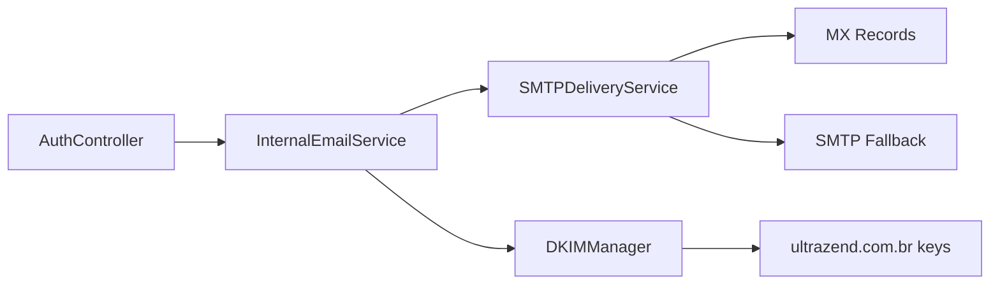
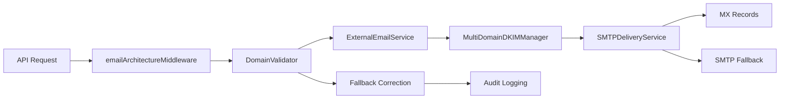

# 🏗️ Arquitetura do Sistema de Emails UltraZend

## 📋 Visão Geral

O sistema de emails UltraZend possui uma arquitetura modular e robusta que separa claramente as responsabilidades entre emails internos da aplicação e emails externos enviados pelos usuários através da API.

### 🎯 Responsabilidades Principais

1. **📧 Emails Internos**: Verificação de conta, recuperação de senha, notificações do sistema
2. **🌐 Emails Externos**: API para usuários enviarem emails através de seus domínios próprios
3. **🚀 Infraestrutura**: Entrega SMTP, gerenciamento DKIM, filas de processamento

---

## 🏛️ Componentes da Arquitetura

### 📧 Sistema de Emails Internos

#### **InternalEmailService**
- **📍 Localização**: `backend/src/services/InternalEmailService.ts`
- **🎯 Responsabilidade**: Emails do sistema UltraZend
- **🌐 Domínio**: `ultrazend.com.br`
- **🔐 DKIM**: Configuração centralizada e estática
- **📨 Métodos Principais**:
  - `sendVerificationEmail()` - Email de confirmação de registro
  - `sendPasswordResetEmail()` - Email de recuperação de senha
  - `sendSystemNotification()` - Notificações gerais do sistema

#### **AuthController Integration**
- **📍 Localização**: `backend/src/controllers/authController.ts`
- **🔗 Integração**: Usa `InternalEmailService` para todos os emails de autenticação
- **⚡ Execução**: Assíncrona via `setImmediate()` para não bloquear API
- **✅ Status**: Corrigido na Fase 1 - antes estava como TODO

### 🌐 Sistema de Emails Externos

#### **ExternalEmailService**
- **📍 Localização**: `backend/src/services/ExternalEmailService.ts`
- **🎯 Responsabilidade**: API de emails dos usuários
- **🌐 Domínios**: Multi-tenant (domínios dos usuários)
- **🔐 DKIM**: Per-domain via `MultiDomainDKIMManager`
- **📊 Features**: Tracking, analytics, auditoria

#### **EmailServiceFactory**
- **📍 Localização**: `backend/src/services/EmailServiceFactory.ts`
- **🏭 Padrão**: Factory Pattern
- **🎯 Função**: Cria instâncias apropriadas dos serviços de email
- **⚙️ Métodos**:
  - `createInternalService()` - Para emails do sistema
  - `createExternalService()` - Para emails da API
  - `createService(type, options)` - Método genérico

### 🚀 Infraestrutura de Entrega

#### **SMTPDeliveryService**
- **📍 Localização**: `backend/src/services/smtpDelivery.ts`
- **🎯 Responsabilidade**: Entrega física dos emails
- **🔄 Método Primário**: Entrega direta aos MX records
- **🛡️ Fallback**: SMTP relay para desenvolvimento/emergência
- **⚡ Lógica Inteligente**:
  - **Produção**: MX direto → Fallback SMTP (se configurado)
  - **Desenvolvimento**: Fallback SMTP → MX direto

#### **DKIM Management**

##### **DKIMManager (Base)**
- **📍 Localização**: `backend/src/services/dkimManager.ts`
- **🎯 Função**: DKIM para domínio principal
- **🔐 Chaves**: Estáticas em `configs/dkim-keys/`
- **⚙️ Inicialização**: Carregadas na inicialização do servidor

##### **MultiDomainDKIMManager**
- **📍 Localização**: `backend/src/services/MultiDomainDKIMManager.ts`
- **🎯 Função**: DKIM para domínios de usuários
- **🔄 Geração**: Automática por domínio
- **🛡️ Fallback**: Configuração padrão para domínios não verificados
- **💾 Armazenamento**: Tabela `dkim_keys`
- **✅ Status**: Corrigido na Fase 1 - agora permite fallback

### 🛡️ Middleware e Validação

#### **emailArchitectureMiddleware**
- **📍 Localização**: `backend/src/middleware/emailArchitectureMiddleware.ts`
- **🎯 Função**: Middleware unificado para emails externos
- **🔍 Validação**: Domínios, limites, autenticação
- **🔄 Correção**: Fallback automático para remetentes inválidos
- **✅ Status**: Sistema unificado na Fase 2

#### **DomainValidator**
- **📍 Localização**: `backend/src/services/DomainValidator.ts`
- **🔍 Validação**: Propriedade e verificação de domínios
- **🔄 Fallback**: `noreply+user{id}@ultrazend.com.br` para domínios inválidos
- **📊 Logging**: Auditoria completa de correções

---

## 📊 Fluxo de Dados

### 📧 Email Interno


### 🌐 Email Externo


---

## 🗂️ Estrutura de Arquivos

```
backend/src/
├── 📧 controllers/
│   └── authController.ts          # ✅ Usa InternalEmailService
├── 🛡️ middleware/
│   ├── emailArchitectureMiddleware.ts  # 🆕 Middleware unificado
│   └── emailValidation.ts         # ❌ REMOVIDO na Fase 2
├── 🚀 services/
│   ├── InternalEmailService.ts    # 📧 Emails do sistema
│   ├── ExternalEmailService.ts    # 🌐 API de emails
│   ├── EmailServiceFactory.ts     # 🏭 Factory pattern
│   ├── DomainValidator.ts         # 🔍 Validação de domínios
│   ├── dkimManager.ts             # 🔐 DKIM base
│   ├── MultiDomainDKIMManager.ts  # 🔐 DKIM multi-domínio
│   └── smtpDelivery.ts           # 🚀 Entrega SMTP
├── 📁 routes/
│   ├── auth.ts                   # 🔐 Autenticação
│   └── emails.ts                 # 📧 API de emails
└── 🧪 tests/
    ├── unit/
    │   ├── controllers/
    │   └── services/
    └── integration/
```

---

## ⚙️ Configuração e Variáveis de Ambiente

### 📧 Emails Internos
```env
# Configuração do domínio principal
MAIL_FROM_NAME=ULTRAZEND
MAIL_FROM_EMAIL=noreply@ultrazend.com.br

# DKIM para domínio principal
DKIM_PRIVATE_KEY_PATH=./configs/dkim-keys/ultrazend.com.br-default-private.pem
DKIM_SELECTOR=default
DKIM_DOMAIN=ultrazend.com.br
```

### 🚀 SMTP Delivery
```env
# Configuração de entrega
SMTP_HOSTNAME=localhost
SMTP_MX_PORT=2526

# ✅ NOVO: Fallback SMTP (Fase 2)
SMTP_FALLBACK_HOST=localhost
SMTP_FALLBACK_PORT=1025
SMTP_FALLBACK_SECURE=false
SMTP_FALLBACK_USER=
SMTP_FALLBACK_PASS=
```

### 🌐 URLs e Frontend
```env
# URLs para links em emails
FRONTEND_URL=http://localhost:3000
BACKEND_URL=http://localhost:3001
```

---

## 🔄 Padrões de Integração

### 1. **Factory Pattern**
```typescript
// ✅ Criação de serviços
const internalService = await EmailServiceFactory.createInternalService();
const externalService = await EmailServiceFactory.createExternalService();
```

### 2. **Fallback Strategy**
```typescript
// ✅ Domínio não verificado
if (!domainRecord.is_verified) {
  return await this.getDefaultDKIMConfig(); // Fallback seguro
}

// ✅ SMTP fallback
if (this.hasSMTPFallbackConfig()) {
  return await this.deliverViaSMTPRelay(emailData);
}
```

### 3. **Async Processing**
```typescript
// ✅ Não bloquear API
setImmediate(async () => {
  await internalEmailService.sendPasswordResetEmail(email, name, resetUrl);
});
```

---

## 🧪 Testes e Qualidade

### 🏗️ Estrutura de Testes
```
backend/src/tests/
├── unit/
│   ├── controllers/
│   │   └── authController.test.ts      # Testa Fase 1 corrections
│   └── services/
│       └── MultiDomainDKIMManager.test.ts  # Testa DKIM fallback
└── integration/
    └── email-flow.test.ts              # Testa fluxo completo
```

### 🔍 Type Safety
- **✅ Zero `as any`**: Substituído por interfaces adequadas
- **📋 Interfaces**: `backend/src/types/database.ts`
- **🛡️ Helper Functions**: `parseCount()`, `calculateSuccessRate()`

---

## 🚨 Troubleshooting Rápido

### ❌ Email de Recuperação Não Chega
```bash
# Verificar se InternalEmailService está sendo usado
grep "sendPasswordResetEmail" logs/*.log

# Verificar configuração
echo $FRONTEND_URL
```

### ❌ DKIM Não Funciona
```bash
# Verificar chaves DKIM
ls -la configs/dkim-keys/

# Testar DNS
dig TXT default._domainkey.ultrazend.com.br
```

### ❌ Fallback SMTP Não Funciona
```bash
# Verificar configuração
echo $SMTP_FALLBACK_HOST
echo $SMTP_FALLBACK_PORT

# Testar MailHog
curl http://localhost:8025
```

---

## 📈 Métricas e Monitoramento

### 📊 Estatísticas Coletadas
- Total de emails enviados
- Taxa de entrega
- Taxa de modificação (fallback)
- Erros por tipo
- Performance DKIM

### 📝 Logs Estruturados
- Todas as operações são logadas
- Correções de domínio auditadas
- Falhas de entrega rastreadas
- Métricas de performance coletadas

---

## 🔄 Histórico de Evolução

### ✅ **Fase 1**: Correções Críticas
- Implementada recuperação de senha
- Unificado uso do InternalEmailService
- Adicionado fallback DKIM para domínios não verificados

### ✅ **Fase 2**: Limpeza e Organização
- Removido middleware antigo
- Implementado fallback SMTP
- Arquitetura unificada

### ✅ **Fase 3**: Qualidade e Documentação
- Eliminado `as any` - type safety completo
- Testes automatizados implementados
- Documentação completa criada

---

## 🔮 Roadmap Futuro

### 🚀 Melhorias Planejadas
- **Webhooks**: Sistema de callbacks para status de entrega
- **Templates**: Sistema de templates de email
- **Analytics**: Dashboard de métricas avançadas
- **Scaling**: Suporte a múltiplos workers
- **Monitoring**: Alertas proativos para falhas

### 📊 Otimizações
- Cache de configurações DKIM
- Pool de conexões SMTP
- Retry inteligente com backoff
- Compressão de logs antigos

---

*Documentação criada em: Janeiro 2025*  
*Versão: 3.0 (Pós Fases 1-3)*  
*Status: Arquitetura Estável e Produção-Ready*